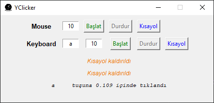

# ⌨️ YClicker

Windows 10 için otomatik mouse ve klavye tetikleyicisi

## 👀 Hızlı Bakış

- ⌨️ Mouse ve klavye basımlarını saniyede verilen miktar kadar tekrarlar
- 🔘 Başlat ve Durdur butonlarının ayrı olmasından dolayı tuş tetiklemeleri ile yanlışlıkla basımı engeller
- 💁‍♂️ İsteğe bağlı kısayollar ile otomatik basımları tetikleyebilirsiniz

## 🌟 Resimler




## 👷‍♂️ Exe Haline Çevirme

- 🧰 `pip install -r requirements.txt` ile gereksinimleri indirin
- ⏬ `pip install auto-py-exe` komutu ile paketi indirin
- ⭐ One file ile tek dosya içerisinde sıkıştırılmış bir exe oluşturulur
- 🖤 Window based ile konsolu açmadan pencere yapısında çalıştırır
- 🖼️ Icon yolu olarak exe dosyasında olmasını istediğiniz **ico** uzantılı dosya yolunu verin
- 📂 Additional Files kısmından kodumuzda kullanılan ek dizinleri ekleyin
- 📢 PyInstaller'ın ek dizinlerdeki yolları kodda bulabilmesi için en alttaki kodu kullanın
- ⚙️ Advanced alanında uygulamınızın ismini belirleyebilirsiniz

> 📢 Python 3.7 ve sonrası için sorun oluşması durumunda **python 3.7 veya aşağısı** indirin


```py
def resource_path(relative_path):
    """ Get absolute path to resource, works for dev and for PyInstaller """
    try:
        # PyInstaller creates a temp folder and stores path in _MEIPASS
        base_path = sys._MEIPASS
    except Exception:
        base_path = os.path.abspath(".")

    return os.path.join(base_path, relative_path)

self.window.iconphoto(True, PhotoImage(file = resource_path('images/icon.png')))
```

> Detaylı bilgi için